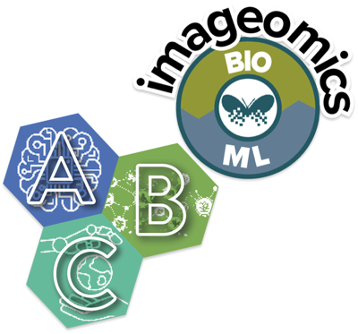

<!-- _class: title-inverted -->

# Operating safely, ethically and legally

## Experiential AI & Ecology Module 3: multimodal ecosystem sensing

Steve Bullock · University of Bristol

<!--
Hi, I'm Steve Bullock from the University of Bristol and Bristol Flight Lab.
This is a ten-minute introduction to my part of the live session: how to
use the sensing technologies Justin and Devis are talking about safely,
ethically and legally. It goes with the short reading and the capability
audit canvas on the course page.
-->

---

# Every capability is a responsibility

<svg viewBox="0 0 470 430" width="470" height="430" xmlns="http://www.w3.org/2000/svg" font-size="21">
  <line x1="60" y1="20" x2="60" y2="400" stroke="#555" stroke-width="3"/>
  <polygon points="60,8 52,24 68,24" fill="#555"/>
  <text x="18" y="215" fill="#555" font-size="15" font-weight="700" transform="rotate(-90 18 215)" text-anchor="middle">HEIGHT ABOVE GROUND</text>
  <g>
    <circle cx="60" cy="50" r="14" fill="#9278d1"/><text x="92" y="44" font-weight="700">Satellites</text><text x="92" y="68" fill="#555" font-size="18">~500 km · whole regions, repeat visits</text>
    <circle cx="60" cy="140" r="14" fill="#0cc6de"/><text x="92" y="134" font-weight="700">Crewed aircraft</text><text x="92" y="158" fill="#555" font-size="18">~1 km · censuses, lidar</text>
    <circle cx="60" cy="225" r="14" fill="#00c0b5"/><text x="92" y="219" font-weight="700">Drones</text><text x="92" y="243" fill="#555" font-size="18">~100 m · centimetre imagery</text>
    <circle cx="60" cy="310" r="14" fill="#bed600"/><text x="92" y="304" font-weight="700">Camera traps &amp; acoustics</text><text x="92" y="328" fill="#555" font-size="18">~1 m · always on, for months</text>
    <circle cx="60" cy="390" r="14" fill="#ee7219"/><text x="92" y="384" font-weight="700">eDNA</text><text x="92" y="408" fill="#555" font-size="18">in the water and soil</text>
  </g>
</svg>

**…and the AI that turns it all into counts and maps.**

Three lenses:

Safenobody, human or animal, gets hurt

Ethicalwhat you <em>should</em> do, not just what you <em>can</em>

Legalthe rules where and how you work

<a href="https://www.youtube.com/watch?v=3jlSPXSEdww">Tuia, Remote sensing crash course</a> · <a href="https://doi.org/10.1038/s41467-022-27980-y">Tuia et al. 2022, Nat Commun</a> · <a href="https://doi.org/10.1111/2041-210x.70133">Kitzes et al. 2025, MEE</a>

<!--
Devis's crash course takes you from satellites down to a drone over a herd.
Add camera traps, acoustics, eDNA and the models, and it's an extraordinary
toolkit. Every capability in it is also a responsibility. I'll look through
three lenses: safe, ethical, legal.
-->

---

# Safe is not the same as compliant

**Safety** = reducing the actual risk of harm

**Compliance** = following the applicable rules, standards and procedures

You can be **compliant but unsafe**, if the rules are incomplete or applied mechanically.

You can be **safe but not compliant**, if you break a formal requirement even when the real risk is low.

<svg viewBox="0 0 520 470" width="460" height="416" xmlns="http://www.w3.org/2000/svg" font-size="24" font-weight="700" text-anchor="middle">
  <circle cx="190" cy="170" r="150" fill="#00c0b5" fill-opacity="0.35"/>
  <circle cx="330" cy="170" r="150" fill="#9278d1" fill-opacity="0.35"/>
  <circle cx="260" cy="295" r="150" fill="#ee7219" fill-opacity="0.35"/>
  <text x="130" y="130">Safe</text>
  <text x="390" y="130">Legal</text>
  <text x="260" y="405">Ethical</text>
  <circle cx="260" cy="215" r="44" fill="#b01c2e"/>
  <text x="260" y="211" fill="#fff" font-size="18">Aim</text>
  <text x="260" y="233" fill="#fff" font-size="18">here</text>
</svg>

<a href="https://www.hse.gov.uk/simple-health-safety/risk/index.htm">HSE: managing risks and risk assessment</a> · <a href="https://steve.engineer/teaching/imageomics2026/reading/">Reading: Safe, ethical, legal</a>

<!--
Safety and compliance overlap, but they aren't the same. If you only tick
boxes you can still hurt someone; if you only trust your own judgement you
can still end up in serious trouble. And neither guarantees you're doing the
right thing. Aim for the middle.
-->

---

<!-- _class: section -->

# Safe

## Nobody, human or animal, gets hurt

---

# Assess the risk before you go

<b>1 · Hazards</b>people, animals, kit, environment

<b>2 · Harm</b>who could be hurt, how likely, how badly?

<b>3 · Controls</b>work down the hierarchy

<b>4 · Plan B</b>emergencies, comms, check-ins

<b>5 · Review</b>on site, and after near misses

Use your **institution's fieldwork risk assessment** and the course's **field safety plan**. They're there to make you think, not to collect signatures.

<svg viewBox="0 0 520 230" width="520" height="230" xmlns="http://www.w3.org/2000/svg" font-size="18">
  <rect x="0" y="0" width="520" height="100" fill="#c9f1f7"/>
  <rect x="0" y="130" width="520" height="100" fill="#e9f0c4"/>
  <path d="M380 40 l40 -6 l8 4 l-40 6 z M398 30 l6 18" stroke="#555" stroke-width="3" fill="#555"/>
  <g transform="translate(260 115)">
    <line x1="-16" y1="-16" x2="16" y2="16" stroke="#1d1d1b" stroke-width="4"/><line x1="16" y1="-16" x2="-16" y2="16" stroke="#1d1d1b" stroke-width="4"/>
    <circle cx="-18" cy="-18" r="9" fill="#b01c2e"/><circle cx="18" cy="-18" r="9" fill="#b01c2e"/><circle cx="-18" cy="18" r="9" fill="#b01c2e"/><circle cx="18" cy="18" r="9" fill="#b01c2e"/>
  </g>
  <g fill="#555"><circle cx="420" cy="178" r="8"/><rect x="413" y="188" width="14" height="26" rx="5"/><circle cx="450" cy="178" r="8"/><rect x="443" y="188" width="14" height="26" rx="5"/><polygon points="470,214 470,190 488,176 506,190 506,214"/></g>
  <text x="16" y="34" font-weight="700">Air risk</text><text x="16" y="60" fill="#333">what else is in the sky?</text>
  <text x="16" y="168" font-weight="700">Ground risk</text><text x="16" y="194" fill="#333">who and what is underneath?</text>
</svg>

<a href="https://www.usha.org.uk/wp-content/uploads/2023/03/MASTERUSHA_Safety-in-Fieldwork-Guide.pdf">USHA/UCEA, Health and safety in fieldwork</a> · <a href="https://imageomics-abc-edu.github.io/AI-Ecology-2026/">Course field safety plan</a> · <a href="https://www.easa.europa.eu/en/domains/drones-air-mobility/operating-drone/specific-category-civil-drones">EASA Specific category and SORA</a>

<!--
Use your institution's fieldwork risk assessment, and the course's own field
safety plan. The steps are the same everywhere: hazards, harm, controls,
plan B, review. For drones beyond the lowest-risk category, Europe and the
UK use SORA, which splits ground risk from air risk. Even if you never write
one, that split is a useful way to think about any flight.
-->

---

# The hierarchy of controls

<svg viewBox="0 0 1136 500" width="1136" height="500" xmlns="http://www.w3.org/2000/svg" font-size="22">
  <defs><marker id="ah" markerWidth="12" markerHeight="12" refX="6" refY="6" orient="auto"><path d="M0,0 L12,6 L0,12 z" fill="#555"/></marker></defs>
  <line x1="40" y1="20" x2="40" y2="470" stroke="#555" stroke-width="4" marker-end="url(#ah)"/>
  <text x="70" y="30" font-size="17" font-weight="700" fill="#00a39a">MOST EFFECTIVE</text>
  <text x="70" y="475" font-size="17" font-weight="700" fill="#b01c2e">LEAST EFFECTIVE</text>
  <g text-anchor="middle" font-weight="700">
    <polygon points="90,48 610,48 576,128 124,128" fill="#00c0b5"/><text x="350" y="96">Eliminate</text>
    <polygon points="128,136 572,136 538,216 162,216" fill="#0cc6de"/><text x="350" y="184">Substitute</text>
    <polygon points="166,224 534,224 500,304 200,304" fill="#bed600"/><text x="350" y="272">Engineer</text>
    <polygon points="204,312 496,312 462,392 238,392" fill="#ee7219"/><text x="350" y="360">Procedures</text>
    <polygon points="242,400 458,400 424,470 276,470" fill="#b01c2e"/><text x="350" y="443" fill="#fff">PPE</text>
  </g>
  <g fill="#1d1d1b">
    <line x1="620" y1="88" x2="660" y2="88" stroke="#bbb" stroke-dasharray="4 4"/><text x="672" y="95">Don't fly over people; survey from the boat</text>
    <line x1="582" y1="176" x2="660" y2="176" stroke="#bbb" stroke-dasharray="4 4"/><text x="672" y="183">A lighter drone; a camera trap, not a hide</text>
    <line x1="544" y1="264" x2="660" y2="264" stroke="#bbb" stroke-dasharray="4 4"/><text x="672" y="271">Geofence, prop guards, parachute</text>
    <line x1="506" y1="352" x2="660" y2="352" stroke="#bbb" stroke-dasharray="4 4"/><text x="672" y="359">Checklists, briefings, a visual observer</text>
    <line x1="468" y1="436" x2="660" y2="436" stroke="#bbb" stroke-dasharray="4 4"/><text x="672" y="443">Hi-vis, helmet, LiPo-safe bag</text>
  </g>
</svg>

<a href="https://www.legislation.gov.uk/uksi/1999/3242/schedule/1/made">Principles of prevention, MHSWR 1999 Sch. 1</a> · <a href="https://www.hse.gov.uk/simple-health-safety/risk/index.htm">HSE: risk assessment</a>

<!--
When you choose controls, work from the top. Removing the hazard beats
everything else; personal protective equipment is the last resort, not the
first. The examples on the right are from drone and fieldwork planning.
-->

---

# Procedures, every time

### Two golden rules

1 <strong>Develop and use procedures and checklists.</strong> Otherwise, at some point, you will forget something critical.

2 <strong>Never have the propellers fitted and the battery connected at the same time</strong>, unless you are about to take off.

### Field lessons

<ul class="check">
<li>Do your homework, with local people and institutions</li>
<li>Do the paperwork before you go</li>
<li>Recce the site if you can</li>
<li>Clear test plan; beware scope creep</li>
<li>Plan rest days</li>
<li>Don't count on one deployment</li>
<li>Keep structured records</li>
</ul>

<a href="https://www.caa.co.uk/drones/open-category/drone-code/">CAA Drone Code</a> · <a href="https://www.faa.gov/uas/recreational_flyers">FAA: Recreational flyers</a>

<!--
Two rules every drone lab learns the hard way: use procedures and
checklists, and never have the props on and the battery connected unless
you're about to fly. The field lessons apply just as much to a camera-trap
grid or an acoustic array: work with local people, do the paperwork early,
plan rest, and expect to go back more than once.
-->

---

# Who else is at risk?

<h3>The animals</h3>

Drones can disturb wildlife in ways a person on foot would not: species, altitude, approach and noise all matter.

<h3>People nearby</h3>

Communities, landowners, other airspace users, your own team.

<h3>People downstream</h3>

If a detector misses a poacher or overcounts a population, someone acts on a wrong answer.

<strong>Who checks the model?</strong>

<a href="https://doi.org/10.1016/j.cub.2016.04.001">Hodgson & Koh 2016, Curr Biol</a> · <a href="https://doi.org/10.1371/journal.pone.0178448">Mulero-Pázmány et al. 2017, PLOS ONE</a> · <a href="https://doi.org/10.1038/s41467-022-27980-y">Tuia et al. 2022</a>

<!--
Your risk assessment should include the animals: there's good evidence on
drone disturbance and good practice for reducing it. And it should include
people downstream of your outputs. Automated pipelines make mistakes at
scale. Who checks?
-->

---

<!-- _class: section -->

# Ethical

## What you should do, not only what you can

---

# Technology is not ethically neutral

Built to…

…but also

A thermal drone finds animals at night

→

finds people

Camera traps record wildlife

→

photograph hunters, herders and villagers

Acoustic recorders capture birdsong

→

capture speech

Precise locations support conservation

→

guide poachers and collectors

50 cm imagery resolves one animal

→

resolves homes and vehicles

An open model tracks animals

→

tracks people

Start with <strong>Sandbrook et al. (2021)</strong>: principles for socially responsible conservation monitoring.

<a href="https://doi.org/10.1111/csp2.374">Sandbrook et al. 2021</a> · <a href="https://doi.org/10.1007/s13280-015-0714-0">Sandbrook 2015</a> · <a href="https://doi.org/10.1002/2688-8319.12033">Sharma et al. 2020</a> · <a href="https://doi.org/10.1111/2041-210X.14005">Cretois et al. 2022</a> · <a href="https://doi.org/10.1126/science.aan1362">Lindenmayer & Scheele 2017</a> · <a href="https://doi.org/10.1016/j.polgeo.2020.102163">Millner 2020</a>

<!--
Design choices decide what a system can do, and to whom: which sensors, how
much autonomy, what data you keep, what you release. Every one of these is
a real example, and conservation technology has been used against the
communities who live where it's deployed. Sandbrook and colleagues' 2021
principles are the best single place to start.
-->

---

# Design values in from the start

**Value-sensitive design** (Friedman & Hendry 2019): who are the stakeholders, which values are at stake, and how do you build them in?

Privacy

Animal welfare

SPECIFY

JUSTIFY

Value

Privacy of people near the study site

Wildlife isn't harmed or disturbed

Norm

People captured by accident aren't identifiable

Approaches stay below a disturbance threshold

Design requirement

Detect and blur people on the device, before storage; geofence villages

Minimum altitude and approach rules; abort on a behavioural response

<a href="https://mitpress.mit.edu/9780262039536/value-sensitive-design/">Friedman & Hendry 2019, Value Sensitive Design</a> · <a href="https://doi.org/10.1007/978-94-007-7762-0_20">van de Poel 2013, Translating values into design requirements</a>

<!--
Value-sensitive design treats ethics as part of design, not a form at the
end. The values hierarchy turns an abstract value into a norm, and the norm
into something you can build or test. Read it top-down to specify, or
bottom-up to justify why a requirement exists.
-->

---

# Capability caution

CAPABILITYGOOD ENOUGH FOR THE MISSION: STOPMAXIMUM

neededmisuse risk grows, mission gains little

Ask of each capability: **do we need it, and how could it be misused?**

1. **Context of use:** where, by whom, under whose rules?
2. **Privacy:** what does it record that it doesn't need?
3. **Jobs and human skills:** whose work does it change or replace?
4. **Safety, security and misuse:** who could use it, or its data, for harm?
5. **The future:** what will it make possible in ten years, in other hands?

<a href="https://doi.org/10.1109/ICUAS48674.2020.9214008">Cawthorne & Devos 2020, Capability caution in UAV design</a> · <a href="https://doi.org/10.1016/j.respol.2013.05.008">Stilgoe et al. 2013, Responsible innovation</a>

<!--
Capability caution is the design habit that goes with it: an alternative to
maximising every capability. Set "good enough" for the mission, then stop.
These five principles are the questions the canvas asks you to work through
for your own system.
-->

---

# Share data fairly

**FAIR** is about data

<b>F</b>Findable

<b>A</b>Accessible

<b>I</b>Interoperable

<b>R</b>Reusable

**CARE** is about people

<b>C</b>Collective benefit

<b>A</b>Authority to control

<b>R</b>Responsibility

<b>E</b>Ethics

- Who benefits from your data and models?
- Do the communities where you collect gain anything?
- Do sensitive species' locations need generalising before release?
- Does your work need **ethics review**? Animals, people (even by accident), fieldwork abroad, eDNA, Indigenous lands or data

<a href="https://www.go-fair.org/fair-principles/">GO FAIR</a> · <a href="https://www.gida-global.org/careprinciples">GIDA CARE principles</a> · <a href="https://doi.org/10.15468/doc-5jp4-5g10">Chapman 2020, GBIF sensitive species data</a> · <a href="https://www.wildlifeinsights.org/faq">Wildlife Insights FAQ</a>

<!--
Open data makes science better, but open isn't always fair or safe. FAIR
and CARE work together. GBIF has good guidance on generalising sensitive
species locations. And find your ethics committee early: approval can take
months.
-->

---

<!-- _class: section -->

# Legal

## Mostly drones: flying puts you under aviation law everywhere

---

# UK and EU: risk-based, not purpose-based

<strong>Correct as of October 2026, and my interpretation.</strong> Not legal advice. It's up to you to operate within the requirements of where you fly and of your own institution.

<b>Open</b>low risk: registration and an online test

<b>Specific</b>operational authorisation, from a risk assessment

<b>Certified</b>regulated like crewed aviation

LOWER RISKHIGHER RISK

**No recreational/commercial distinction.** Same drone, same place, same rules.

**UK (CAA):** free **Flyer ID** from 100 g since January 2026, plus an **Operator ID**

**EU (EASA):** register and pass the free **A1/A3** online exam with your national authority

<a href="https://www.caa.co.uk/drones/open-category/getting-started-with-drones-and-model-aircraft/get-a-flyer-id/">CAA: Flyer ID</a> · <a href="https://www.caa.co.uk/drones/open-category/drone-code/updates/">CAA: Drone Code updates</a> · <a href="https://www.easa.europa.eu/en/domains/drones-air-mobility/operating-drone/open-category-low-risk-civil-drones">EASA: Open category</a> · <a href="https://www.easa.europa.eu/en/domains/civil-drones/naa">EASA: national authorities</a>

<!--
The UK and EU regulate by risk, not by why you fly, so these first
qualifications are a real first step for research. The UK rules changed in
January: you now need a Flyer ID from 100 grams. In the EU, use your
national authority's official site; there are fake licence sites.
-->

---

# US: Part 107 or the recreational exception

<svg viewBox="0 0 1136 420" width="1136" height="420" xmlns="http://www.w3.org/2000/svg" font-size="20">
  <defs><marker id="ar" markerWidth="12" markerHeight="12" refX="10" refY="6" orient="auto"><path d="M0,0 L12,6 L0,12 z" fill="#555"/></marker></defs>
  <g stroke="#555" stroke-width="3" fill="none" marker-end="url(#ar)">
    <path d="M300 75 H 455"/><path d="M190 115 V 230"/><path d="M640 115 V 230"/><path d="M750 75 H 905"/>
  </g>
  <g font-size="17" font-weight="700" fill="#555"><text x="355" y="65">NO</text><text x="200" y="185">YES</text><text x="650" y="185">YES</text><text x="805" y="65">NO</text></g>
  <rect x="40" y="35" width="260" height="80" rx="40" fill="#e3e6e5"/><text x="170" y="70" text-anchor="middle" font-weight="700">Flying strictly</text><text x="170" y="96" text-anchor="middle" font-weight="700">for fun?</text>
  <rect x="460" y="35" width="290" height="80" rx="40" fill="#e3e6e5"/><text x="605" y="68" text-anchor="middle" font-weight="700">Research flown by a</text><text x="605" y="94" text-anchor="middle" font-weight="700">university, as the university?</text>
  <rect x="910" y="25" width="200" height="100" rx="10" fill="#b01c2e"/><text x="1010" y="68" text-anchor="middle" font-weight="700" fill="#fff" font-size="24">Part 107</text><text x="1010" y="96" text-anchor="middle" fill="#fff" font-size="16">14 CFR 107</text>
  <rect x="40" y="235" width="300" height="150" rx="10" fill="#e2daf4"/>
  <text x="58" y="268" font-weight="700">Recreational exception</text><text x="58" y="294" font-size="16">49 U.S.C. § 44809</text>
  <text x="58" y="326" font-size="17">TRUST, registration, line of sight,</text><text x="58" y="350" font-size="17">400 ft, airspace authorisation,</text><text x="58" y="374" font-size="17">CBO safety guidelines: all of them</text>
  <rect x="470" y="235" width="340" height="150" rx="10" fill="#e2daf4" stroke="#9278d1" stroke-width="3" stroke-dasharray="8 6"/>
  <text x="488" y="268" font-weight="700">May count as recreational</text><text x="488" y="294" font-size="16">P.L. 116-283 §10002 (2021)</text>
  <text x="488" y="326" font-size="17">Within every § 44809 limit. Many</text><text x="488" y="350" font-size="17">universities require Part 107 anyway:</text><text x="488" y="374" font-size="17" font-weight="700">ask yours</text>
  <text x="910" y="170" font-size="17" fill="#333">Most research flying:</text><text x="910" y="194" font-size="17" fill="#333">companies, agencies,</text><text x="910" y="218" font-size="17" fill="#333">NGOs, and you as an</text><text x="910" y="242" font-size="17" fill="#333">individual</text>
</svg>

<a href="https://www.law.cornell.edu/uscode/text/49/44809">49 U.S.C. § 44809</a> · <a href="https://www.govinfo.gov/content/pkg/PLAW-116publ283/pdf/PLAW-116publ283.pdf">P.L. 116-283 §10002</a> · <a href="https://www.ecfr.gov/current/title-14/chapter-I/subchapter-F/part-107">14 CFR Part 107</a> · <a href="https://www.faa.gov/uas/educational_users">FAA: Educational users</a> · <a href="https://www.faa.gov/uas/recreational_flyers/knowledge_test_updates">FAA: TRUST</a>

<!--
The US does distinguish by purpose. Training courses, Embry-Riddle's
included, say if it isn't for fun you need Part 107, and for most people
that's right. But since 2021 the law has counted university research as
recreational, within all the recreational limits. It doesn't cover
companies, agencies or NGOs, and many universities require Part 107 anyway.
-->

---

# Check before you fly, and beyond aviation

**Everywhere:** some countries restrict drones heavily, need import permits, or ban them in protected areas. Check the aviation authority, the protected-area authority and local partners well before you travel, and an airspace map on the day.

<h3>Privacy</h3>People in images and audio are personal data

<h3>Wildlife</h3>Disturbance offences, research permits

<h3>Genetic resources</h3>eDNA and the Nagoya Protocol

<h3>Export controls</h3>Thermal cameras, some drones and software

<h3>Data licences</h3>Commercial imagery terms

<a href="https://ico.org.uk/for-organisations/uk-gdpr-guidance-and-resources/cctv-and-video-surveillance/guidance-on-video-surveillance-including-cctv/additional-considerations-for-technologies-other-than-cctv/unmanned-aerial-systems-uas-drones/">ICO: drones</a> · <a href="https://www.easa.europa.eu/en/domains/civil-drones/privacy">EASA: drones and privacy</a> · <a href="https://www.cbd.int/abs/">Nagoya Protocol</a> · <a href="https://eur-lex.europa.eu/eli/reg/2021/821/oj">EU dual-use Reg. 2021/821</a> · <a href="https://www.faa.gov/uas/getting_started/b4ufly">FAA B4UFLY</a>

<!--
Drones are where the law is most visible, but these apply to every sensor.
Notice how many of them are about data: privacy, sensitive locations,
licences. That's where the AI side of this course meets the law.
-->

---

# Before the live session

1<h3>Drone basics</h3>
<em>~30 min, if you might fly</em>

UK Flyer ID · EU A1/A3 · US TRUST

Explore an airspace map for home and your field site

2<h3>Read</h3>
<em>~10 min</em>

Safe, ethical, legal: with links to go further

3<h3>Capability audit canvas</h3>
<em>~20 min</em>

Fill in parts 1–5 for your own system and upload it

<strong>Part 6, the red team, happens live</strong>

Be specific: <em>"thermal camera at 120 m picks out people in the village by the reserve"</em> beats <em>"privacy"</em>.

<a href="https://steve.engineer/teaching/imageomics2026/">steve.engineer/teaching/imageomics2026</a> · <a href="https://steve.engineer/teaching/imageomics2026/reading/">Reading</a> · <a href="https://steve.engineer/teaching/imageomics2026/imageomics-capability-canvas.docx">Canvas (.docx)</a>

<!--
Three things before the live session, all linked from the course page. In
the session you'll swap canvases with a partner and red-team each other's:
find the worst plausible misuse of their system, then decide what you'd
change in your own. See you there.
-->

---

<!-- _class: title-inverted -->

# See you in the live session

## steve.engineer/teaching/imageomics2026

